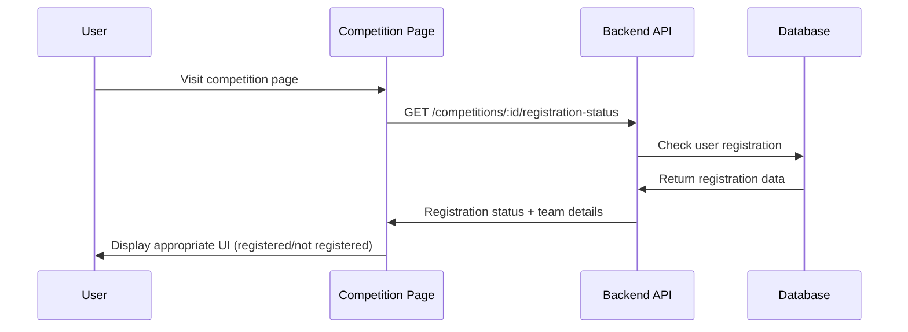
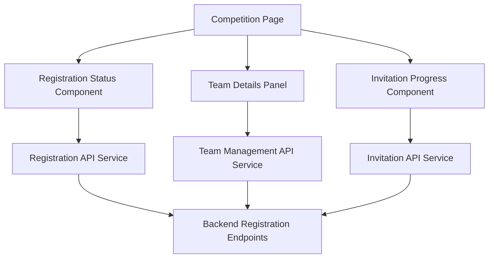

# Competition Registration Status Display - Design Document

## Overview

This feature redesigns the competition page frontend to properly display user registration status, team details, and invitation progress. The solution involves enhancing existing API endpoints, creating new frontend components, and implementing real-time status updates to provide users with accurate registration information.

## Architecture

### High-Level Flow



### Component Architecture



## Components and Interfaces

### Frontend Components

#### 1. RegistrationStatusComponent
```typescript
interface RegistrationStatusProps {
  competitionId: string;
  userId: string;
  onStatusChange?: (status: RegistrationStatus) => void;
}

interface RegistrationStatus {
  isRegistered: boolean;
  registrationType: 'individual' | 'team' | null;
  registrationId?: string;
  status: 'pending' | 'confirmed' | 'rejected';
  registeredAt?: Date;
  canWithdraw: boolean;
}
```

#### 2. TeamDetailsPanel
```typescript
interface TeamDetailsPanelProps {
  registrationId: string;
  isTeamLeader: boolean;
  onTeamUpdate?: () => void;
}

interface TeamDetails {
  teamName: string;
  teamLeader: UserInfo;
  members: TeamMember[];
  invitations: InvitationStatus[];
  teamSize: number;
  maxTeamSize: number;
}
```

#### 3. InvitationProgressComponent
```typescript
interface InvitationProgressProps {
  invitations: InvitationStatus[];
  showActions?: boolean;
  onInvitationAction?: (action: string, invitationId: string) => void;
}

interface InvitationStatus {
  id: string;
  email: string;
  status: 'pending' | 'accepted' | 'rejected' | 'expired';
  sentAt: Date;
  expiresAt: Date;
  respondedAt?: Date;
  canResend: boolean;
}
```

### Backend API Enhancements

#### New Endpoints

1. **GET /api/v1/competitions/:id/registration-status**
   - Returns user's registration status for specific competition
   - Includes team details if applicable
   - Provides invitation information

2. **GET /api/v1/competitions/:id/user-context**
   - Returns complete user context for competition page
   - Combines registration status, invitations, and permissions

3. **PUT /api/v1/registrations/:id/status**
   - Allows users to withdraw from competitions
   - Updates registration status

#### Enhanced Existing Endpoints

1. **GET /api/v1/registrations/:id** (Enhanced)
   - Include invitation details
   - Add team member information
   - Provide action permissions

2. **GET /api/v1/competitions/:id** (Enhanced)
   - Include user's registration status
   - Add registration statistics
   - Provide registration availability

## Data Models

### Frontend State Management

```typescript
interface CompetitionPageState {
  competition: Competition;
  userRegistration: UserRegistration | null;
  teamDetails: TeamDetails | null;
  invitations: InvitationStatus[];
  loading: {
    competition: boolean;
    registration: boolean;
    team: boolean;
  };
  error: string | null;
}

interface UserRegistration {
  id: string;
  type: 'individual' | 'team';
  status: 'pending' | 'confirmed' | 'rejected';
  teamName?: string;
  registeredAt: Date;
  invitationStatus?: 'complete' | 'pending_invitations';
}
```

### API Response Formats

```typescript
// GET /competitions/:id/registration-status
interface RegistrationStatusResponse {
  isRegistered: boolean;
  registration?: {
    id: string;
    type: 'individual' | 'team';
    status: string;
    teamName?: string;
    registeredAt: string;
    invitationStatus?: string;
  };
  team?: {
    name: string;
    leader: UserInfo;
    members: TeamMember[];
    currentSize: number;
    maxSize: number;
  };
  invitations?: InvitationStatus[];
  permissions: {
    canWithdraw: boolean;
    canManageTeam: boolean;
    canInviteMembers: boolean;
  };
}
```

## User Interface Design

### Registration Status Display States

#### 1. Not Registered State
```
┌─────────────────────────────────────┐
│ 🏆 Competition Name                 │
│ ─────────────────────────────────── │
│ Registration Status: Not Registered │
│                                     │
│ [Register as Individual] [Register  │
│                         as Team]    │
└─────────────────────────────────────┘
```

#### 2. Individual Registration State
```
┌─────────────────────────────────────┐
│ ✅ You are registered               │
│ ─────────────────────────────────── │
│ Type: Individual                    │
│ Status: Confirmed                   │
│ Registered: Oct 22, 2024           │
│                                     │
│ [View Details] [Withdraw]           │
└─────────────────────────────────────┘
```

#### 3. Team Registration State
```
┌─────────────────────────────────────┐
│ 👥 Team: "My Awesome Team"          │
│ ─────────────────────────────────── │
│ Status: Pending Invitations         │
│ Team Size: 2/5 members              │
│                                     │
│ Team Members:                       │
│ • John Doe (Leader) ✅              │
│ • jane@email.com (Pending) ⏳       │
│ • bob@email.com (Accepted) ✅        │
│                                     │
│ [Manage Team] [View Details]        │
└─────────────────────────────────────┘
```

### Team Details Panel

```
┌─────────────────────────────────────┐
│ Team Management                     │
│ ─────────────────────────────────── │
│                                     │
│ Team: "My Awesome Team"             │
│ Leader: John Doe                    │
│ Competition: AI Challenge 2024      │
│                                     │
│ Invitations (2 pending):            │
│ ┌─────────────────────────────────┐ │
│ │ jane@email.com                  │ │
│ │ Status: Pending                 │ │
│ │ Expires: Oct 25, 2024          │ │
│ │ [Resend] [Cancel]               │ │
│ └─────────────────────────────────┘ │
│                                     │
│ Confirmed Members (1):              │
│ • bob@email.com (Joined Oct 23)     │
│                                     │
│ [Add Member] [Complete Registration]│
└─────────────────────────────────────┘
```

## Error Handling

### Error States and Messages

1. **Loading Errors**
   - Network connectivity issues
   - API timeout errors
   - Authentication failures

2. **Data Inconsistency Errors**
   - Registration status conflicts
   - Team data synchronization issues
   - Invitation state mismatches

3. **User Action Errors**
   - Withdrawal not allowed
   - Team management permission denied
   - Invitation action failures

### Error Recovery Strategies

1. **Automatic Retry**: For transient network errors
2. **Manual Refresh**: User-initiated data reload
3. **Fallback UI**: Graceful degradation when data unavailable
4. **Error Reporting**: Log errors for debugging

## Performance Considerations

### Optimization Strategies

1. **Data Caching**
   - Cache registration status for 5 minutes
   - Cache team details for 2 minutes
   - Invalidate cache on user actions

2. **Lazy Loading**
   - Load team details only when needed
   - Fetch invitation details on demand
   - Progressive data loading

3. **Real-time Updates**
   - WebSocket connections for invitation updates
   - Polling fallback for older browsers
   - Optimistic UI updates

### Loading States

1. **Skeleton Loading**: Show placeholder content while loading
2. **Progressive Loading**: Load critical data first
3. **Background Updates**: Refresh data without blocking UI

## Security Considerations

### Access Control

1. **Registration Data**: Only show user's own registrations
2. **Team Details**: Restrict based on team membership
3. **Invitation Management**: Only team leaders can manage invitations

### Data Validation

1. **Client-side Validation**: Immediate feedback for user actions
2. **Server-side Validation**: Authoritative validation and security
3. **Input Sanitization**: Prevent XSS and injection attacks

## Integration Points

### Existing System Integration

1. **Authentication System**: Use existing user authentication
2. **Competition API**: Extend existing competition endpoints
3. **Registration System**: Enhance current registration workflow
4. **Email System**: Integrate with invitation email system

### Third-party Integrations

1. **Analytics**: Track user engagement with registration status
2. **Monitoring**: Monitor API performance and errors
3. **Notifications**: Real-time updates for status changes