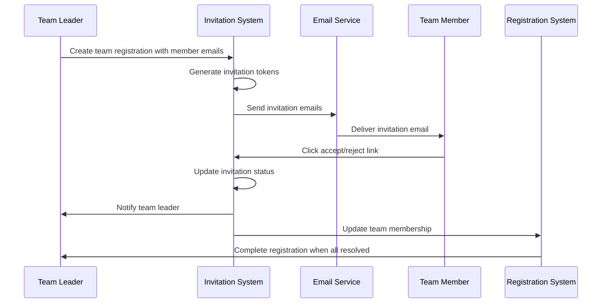

# Design Document

## Overview

The team invitation verification system extends the existing registration workflow by adding a consent-based team formation process. When a team leader registers for an event and adds team members via email, the system will generate unique invitation tokens, send verification emails, and track responses. Only accepted invitations will result in team membership, ensuring all participants explicitly consent to joining the team.

The system integrates seamlessly with the existing Registration model and leverages the current EmailService infrastructure while adding new models and controllers to handle the invitation workflow.

## Architecture

### High-Level Flow



### System Integration

The invitation system integrates with existing components:

- **Registration Model**: Extended to support pending invitations
- **Email Service**: Used for sending invitation and notification emails
- **User Model**: Referenced for team leader and member information
- **Competition Model**: Used for event context and team size validation

## Components and Interfaces

### New Models

#### TeamInvitation Model
```javascript
{
  id: UUID (Primary Key),
  registration_id: UUID (Foreign Key to Registration),
  inviter_id: UUID (Foreign Key to User - team leader),
  invitee_email: STRING (email of invited member),
  invitee_id: UUID (Foreign Key to User, nullable),
  token: STRING (unique invitation token),
  status: ENUM('pending', 'accepted', 'rejected', 'expired'),
  expires_at: DATE,
  responded_at: DATE (nullable),
  created_at: DATE,
  updated_at: DATE
}
```

### Extended Models

#### Registration Model Extensions
- Add `invitation_status` field: ENUM('complete', 'pending_invitations')
- Add instance method `getPendingInvitations()`
- Add instance method `areAllInvitationsResolved()`
- Modify `addMember()` to work with invitation acceptance

### New Controllers

#### InvitationController
- `sendInvitations(registrationId, emails)` - Create and send invitations
- `respondToInvitation(token, response)` - Handle accept/reject responses
- `getInvitationStatus(registrationId)` - Get invitation dashboard data
- `resendInvitation(invitationId)` - Resend invitation email
- `cancelInvitation(invitationId)` - Cancel pending invitation

### New Services

#### InvitationService
- `createInvitations(registration, emails)` - Generate invitation records
- `sendInvitationEmail(invitation)` - Send invitation email
- `processInvitationResponse(token, response)` - Handle invitation response
- `cleanupExpiredInvitations()` - Remove expired invitations
- `notifyTeamLeader(invitation, status)` - Send status updates to team leader

### New Routes

#### /api/invitations
- `POST /send` - Send team invitations
- `GET /respond/:token` - Invitation response page
- `POST /respond/:token` - Process invitation response
- `GET /status/:registrationId` - Get invitation status
- `POST /resend/:invitationId` - Resend invitation
- `DELETE /:invitationId` - Cancel invitation

## Data Models

### TeamInvitation Schema
```sql
CREATE TABLE team_invitations (
  id UUID PRIMARY KEY DEFAULT gen_random_uuid(),
  registration_id UUID NOT NULL REFERENCES registrations(id) ON DELETE CASCADE,
  inviter_id UUID NOT NULL REFERENCES users(id) ON DELETE CASCADE,
  invitee_email VARCHAR(255) NOT NULL,
  invitee_id UUID REFERENCES users(id) ON DELETE SET NULL,
  token VARCHAR(255) UNIQUE NOT NULL,
  status invitation_status_enum DEFAULT 'pending',
  expires_at TIMESTAMP NOT NULL,
  responded_at TIMESTAMP,
  created_at TIMESTAMP DEFAULT NOW(),
  updated_at TIMESTAMP DEFAULT NOW(),
  
  INDEX idx_registration_id (registration_id),
  INDEX idx_token (token),
  INDEX idx_status (status),
  INDEX idx_expires_at (expires_at)
);
```

### Registration Model Updates
```sql
ALTER TABLE registrations 
ADD COLUMN invitation_status invitation_completion_enum DEFAULT 'complete';
```

### Email Templates

#### Invitation Email Template
- Subject: "You're invited to join [Team Name] for [Competition Title]"
- Content includes:
  - Team leader information
  - Competition details
  - Team name
  - Accept/Reject buttons with unique tokens
  - Expiration date

#### Notification Email Templates
- Team leader notifications for accepted/rejected invitations
- Reminder emails for pending invitations
- Expiration notifications

## Error Handling

### Validation Rules
- Email format validation for invitee emails
- Team size limits validation against competition rules
- Duplicate invitation prevention
- Token expiration validation
- User registration conflict detection

### Error Scenarios
1. **Invalid Token**: Return 404 with user-friendly message
2. **Expired Invitation**: Display expiration message with contact info
3. **Already Responded**: Show previous response status
4. **Team Size Exceeded**: Prevent invitation creation
5. **User Already Registered**: Handle registration conflicts gracefully
6. **Email Delivery Failure**: Log error and provide retry mechanism

### Error Response Format
```javascript
{
  success: false,
  error: {
    code: 'INVITATION_EXPIRED',
    message: 'This invitation has expired',
    details: {
      expiredAt: '2024-01-15T10:00:00Z',
      teamLeaderContact: 'leader@example.com'
    }
  }
}
```

## Testing Strategy

### Unit Tests
- TeamInvitation model methods and validations
- InvitationService business logic
- Token generation and validation
- Email template rendering

### Integration Tests
- Complete invitation workflow (send → respond → update team)
- Registration completion with invitation dependencies
- Email service integration
- Database transaction handling

### API Tests
- Invitation creation and sending
- Response handling (accept/reject)
- Status retrieval and updates
- Error scenarios and edge cases

### End-to-End Tests
- Full team formation workflow
- Multi-member invitation scenarios
- Expiration and cleanup processes
- Notification delivery verification

## Security Considerations

### Token Security
- Use cryptographically secure random tokens
- Implement token expiration (default 7 days)
- Single-use tokens for responses
- Rate limiting on invitation sending

### Access Control
- Only team leaders can send invitations for their registrations
- Invitation responses require valid tokens
- Admin oversight for invitation management

### Data Protection
- Hash invitation tokens in database
- Secure email template rendering
- Audit logging for invitation activities
- GDPR compliance for email handling

## Performance Considerations

### Database Optimization
- Indexed queries for invitation lookups
- Efficient cleanup of expired invitations
- Batch processing for multiple invitations

### Email Delivery
- Queue-based email sending for scalability
- Retry mechanisms for failed deliveries
- Template caching for performance

### Caching Strategy
- Cache invitation status for dashboard views
- Redis caching for frequently accessed data
- Invalidation on status changes